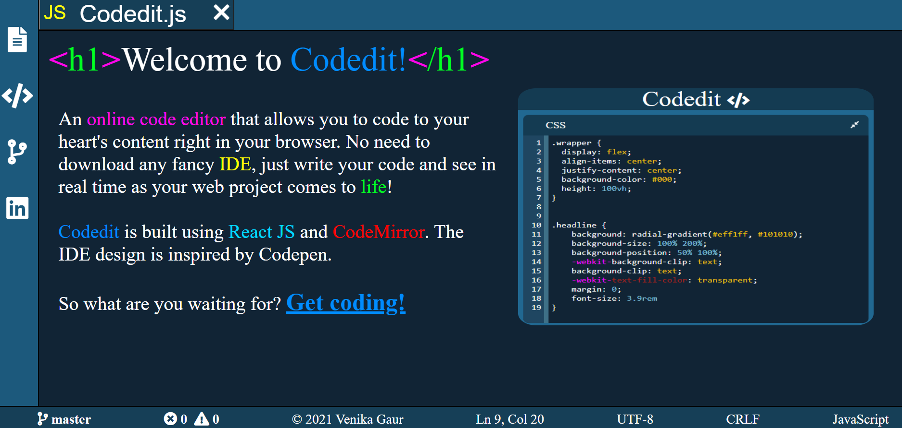
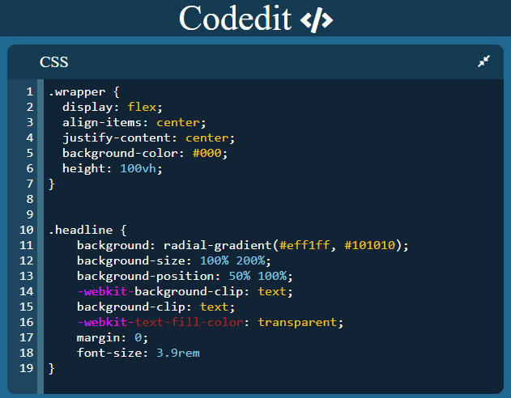

# Codedit
An online code editor that allows you to code to your heart's content right in your browser. No need to download any fancy IDE, just write your code and see in real time as your web project comes to life!

# Development Process
I wanted to create an IDE similar to VS code but in my browser. I began with researching about ways I can support multiple languages and their syntax. I came across codemirror text editor and that made the whole process a lot more simpler. I used react-codemirror2 which allowed me to use codemirror inside React using a custom component. I modelled this webapp after codepen, taking inspiration from the way their online code editor works. I also used React hooks that allows users to have their code be saved locally and can be accessed even after exiting the browser by simply reopening the tab.

# Demo
To try out the app, visit https://codedit.herokuapp.com/     
Works best in desktop browsers. (Heroku may take some time to load)

# Installation
To run the app for yourself, clone the directory. After that, run the following commands in terminal-    
`npm start`

To see the app running, go to localhost:3000    

# Screenshots
 
      

# Future updates
I would like to add user authentication and database to the application. 

# Helpful links
* https://codemirror.net/    
* https://github.com/facebook/create-react-app    
* https://reactjs.org/
